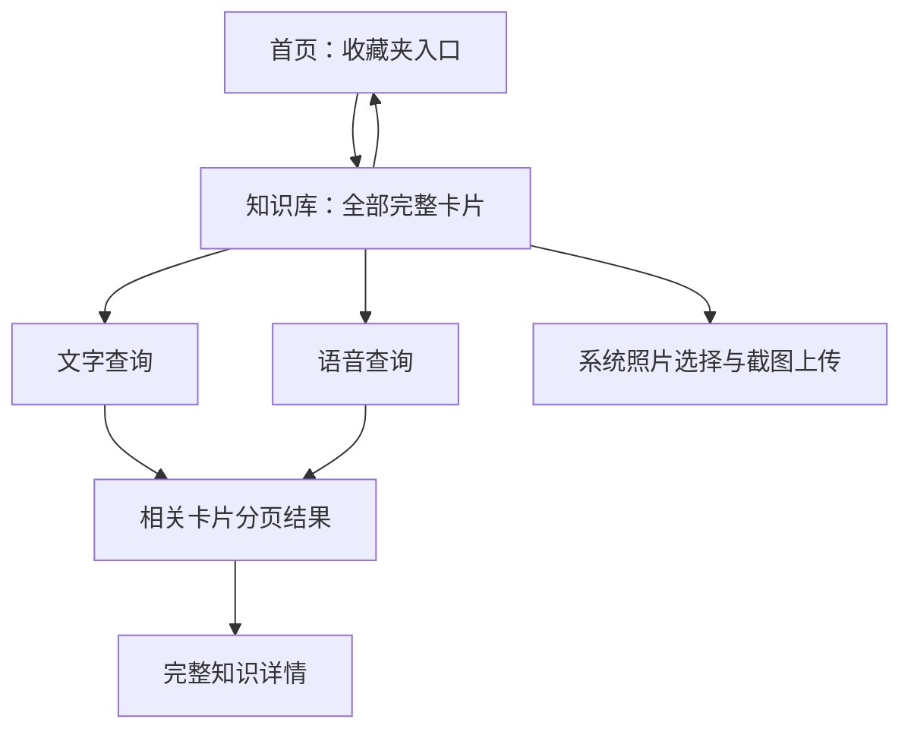
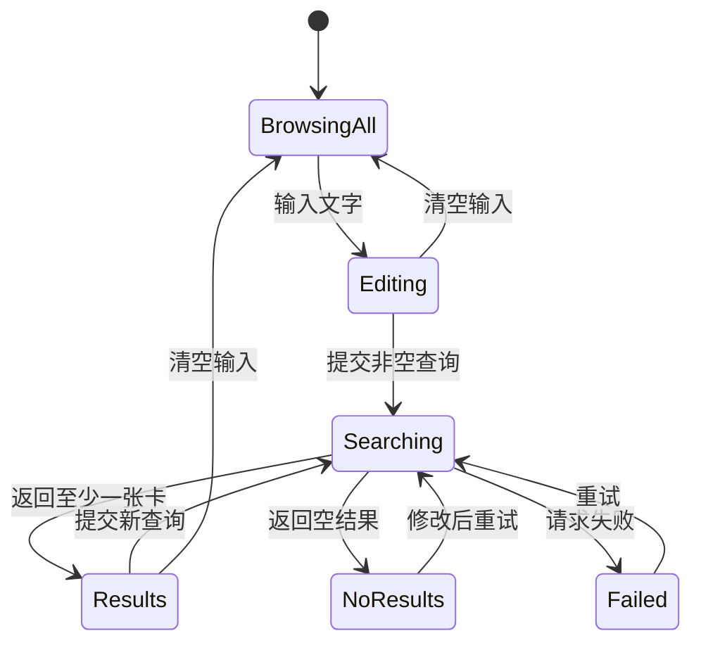

# Omo 知识库浏览与搜索设计规格

日期：2026-08-03  
状态：已确认，进入实施  
设计来源：Figma `Pick The Shell` node `884:324`、用户提供 SVG、当前 Omo 产品合同  
实现边界：完整 SwiftUI 交互 + 可替换 mock 搜索数据层；真实后端向量服务仅冻结合同

## 1. 问题与目标

用户保存的知识卡不断增加后，需要在“不进入复习、不重新刮开”的前提下，快速浏览和找回已经整理好的完整知识。当前系统 `LibraryView` 只是系统列表，缺少 Omo 的视觉语言，也没有文字/语音检索或分页。

本功能的目标不是帮助用户再次测试记忆，而是提供一个低摩擦的“知识取回”入口：

1. 进入知识库即可看到全部完整知识卡片。
2. 用户可用自然语言描述想找的知识，也可口述查询。
3. 搜索结果只重排已有卡片，不生成新知识、不改写原卡、不泄露其他用户数据。
4. 页面保持轻盈、具备收藏夹式的视觉感，同时在卡片数量和文字长度变化时仍然稳定。

## 2. 已确认产品边界

- 知识库卡片直接显示 `coreKnowledge` 完整内容，不使用刮层。
- 首页收藏夹是知识库入口；知识库顶部返回按钮回到首页。
- 知识库加号继续打开已有的截图上传流程。
- 点击卡片打开已有的完整知识详情。
- 本轮不增加分类、筛选、标签、知识图谱、编辑和搜索历史。
- 本轮不建设生产 embedding、向量数据库或后端索引任务。
- Mock 只用于 UI、状态机和 Simulator 验收，必须显式标记且可被生产实现替换；产品文档不得把它写成真实向量检索已经上线。

## 3. 方案比较与选择

### 方案 A：可替换搜索协议 + 完整 mock 交互（采用）

iOS 依赖 `KnowledgeLibrarySearching`，页面只理解请求、结果和失败状态。本轮注入确定性的本地 mock 搜索器，后续真实向量 Endpoint 可在不改 UI 状态机的前提下替换。

优势：可以忠实完成设计和全状态验收；不会为了赶页面而制造一个难以替换的伪后端；测试确定。限制：本轮不能用 Simulator 截图证明真实语义召回质量。

### 方案 B：同步建设真实后端向量检索（不采用）

需要确定 embedding 模型、索引生命周期、向量存储、权限过滤、删除一致性、费用和降级语义，超出本轮页面还原的范围。

### 方案 C：设备端简化 embedding（不采用）

避免后端依赖，但中文和领域术语覆盖、设备差异、模型可用性及未来迁移成本都不稳定，也不符合既定的知识库服务边界。

## 4. 信息架构



知识库是首页的次级页面，但它自身是“浏览全部”和“主动取回”的统一入口。搜索框固定在卡片区域上方，不因翻页移动。

## 5. Figma 视觉结构

以 402 × 874 pt 为参考画布：

- 全屏橙色背景使用现有 `RecallPalette.background`。
- 左上为用户提供的奶油色返回按钮，最小可点击区域不小于 44 × 44 pt。
- 右上复用 Omo 角色素材；角色是品牌氛围，不承担搜索状态的必要信息。
- 奶油色主体面板从搜索框后方延伸到底部，复用现有面板色与圆角语言。
- 搜索框约位于 `x: 21, y: 166, width: 356, height: 76`；奶油底、青绿色描边、20 pt 圆角和轻投影。
- 麦克风使用用户提供 SVG；“帮我找”位于搜索框右侧，搜索中替换为真实旋转的 `ProgressView`，不显示虚假百分比。
- 卡片区域为两列错落布局，使用奶油、青绿、珊瑚三种受控表面色和轻微旋转；旋转只服务于收藏卡片氛围，不改变阅读顺序。
- 底部页点反映当前页；底部收藏夹为页面氛围与知识库语义，上传按钮继续是可操作入口。
- 使用 SF 系统字体和 Dynamic Type，不导入 Figma 的 Inter。

## 6. 卡片排版与分页

### 6.1 卡片内容

卡片至少显示完整 `coreKnowledge`。如果 `hiddenSemantic` 是合法的连续子串，可以用加粗和对比色强调该片段，但绝不遮挡。稀有度只参与颜色/边框等视觉装饰，不形成额外操作步骤，也不代表搜索相关度。

### 6.2 高度适配

卡片高度必须由实际字体、宽度、Dynamic Type 和文本排版测量得到：

`cardHeight = measuredTextHeight + verticalInsets + optionalMetadataHeight`

不得使用“少于 N 个字用某高度”之类的规则。测量算法与实际卡片使用同一字体、字距、行距和宽度约束；长文本允许完整换行，不截断。

### 6.3 分页算法

1. 读取卡片区域的实际宽高与 Dynamic Type 环境。
2. 计算两列固定可用宽度。
3. 按结果顺序把每张卡贪心放入当前页高度较短的一列。
4. 如果放入后会超过页面内容高度，且当前页已至少包含一张卡，则新建下一页。
5. 旋转的视觉包围盒预留安全边距，避免被裁切或碰撞。
6. 查询结果、容器尺寸或 Dynamic Type 变化时重新分页并回到第一页。

页面使用横向分页手势；自定义页点由真实页数生成。超过可舒适显示的页点数量时，仅显示当前页附近窗口并提供 VoiceOver “第 X 页，共 Y 页”，不压缩成不可点击的小点阵。

## 7. 搜索交互

### 7.1 默认与文字输入

- 空查询默认展示全部卡片。
- 点击输入框出现键盘，return key 为 Search。
- 键盘 Search 或“帮我找”提交同一动作。
- 只输入空白等同清空，立即恢复全部卡片。
- 输入变化不会自动发出向量请求，避免不必要的网络成本和结果抖动。
- 用户可通过清除按钮清空查询；清空时取消正在执行的请求并回到全部卡片第一页。

### 7.2 请求并发

每次提交生成独立请求 ID。新请求取消旧 Task；即使旧服务未及时响应，结果也只有在 ID 仍为当前请求时才可写入状态。页面离开时取消请求和语音监听。

### 7.3 搜索状态



- `Searching`：保留当前查询；结果区域使用克制的加载反馈，防止误点旧结果。
- `Results`：按相关性顺序显示，不向用户暴露内部相似度分值。
- `NoResults`：说明没有找到匹配卡片，提供“查看全部”；它与服务失败视觉和语义不同。
- `Failed`：保留查询，提供“重试”；不自动清空或静默展示全部。
- `EmptyLibrary`：说明还没有知识卡，搜索控件保持可理解但不可提交，加号仍可上传。

## 8. 语音输入

### 8.1 用户流程

1. 用户点击麦克风；首次使用请求 Speech Recognition 和 Microphone 权限。
2. 授权后进入 listening，搜索框描边和麦克风有状态变化，同时显示实时转写。
3. 用户再次点击停止，或系统确认最终转写后停止。
4. 非空最终转写自动提交搜索；空转写回到编辑态并给出轻量反馈。
5. 页面离开、开始文字提交或出现系统中断时停止音频引擎并释放 tap。

### 8.2 权限和失败

- 未决定：触发系统权限请求。
- 拒绝/受限：不重复弹系统请求，显示简短说明和“前往设置”。
- 识别器不可用：显示“暂时无法使用语音输入”，文字搜索继续可用。
- 转写失败：保留已有转写文字，允许用户编辑或重试。
- App 不保存原始音频；只把转写后的查询字符串交给搜索器。

Simulator 通过 Debug-only `KnowledgeLibrarySpeechTranscribing` mock 注入最终转写，验证 UI 状态与搜索衔接。真机权限、麦克风质量和网络语音服务不在本轮可证明范围内。

## 9. 数据合同

```swift
struct KnowledgeLibrarySearchDocument: Equatable, Sendable {
    let id: String
    let coreKnowledge: String
    let recallCue: String
    let explanation: String
    let sourceTitle: String
}

struct KnowledgeLibrarySearchRequest: Equatable, Sendable {
    let query: String
    let candidates: [KnowledgeLibrarySearchDocument]
}

struct KnowledgeLibrarySearchResponse: Equatable, Sendable {
    let orderedCardIDs: [String]
}

protocol KnowledgeLibrarySearching: Sendable {
    func search(_ request: KnowledgeLibrarySearchRequest) async throws
        -> KnowledgeLibrarySearchResponse
}
```

UI 只向搜索器提供当前用户已加载卡片构成的候选边界；真实后端 Adapter 只需发送候选 ID，本地 Debug mock 则可读取合成候选文字。响应只接受这些候选中的 ID，映射时过滤未知、重复或已经删除的 ID。后续真实服务至少需要：

- 在鉴权用户范围内检索；
- 索引新增、更新和删除与卡片持久化一致；
- 返回稳定有序的 card IDs；
- 支持请求取消/超时和明确错误；
- 不回传 embedding 或内部相似度；
- 不把查询或音频用于未披露的训练与长期留存。

本轮 mock 可以使用合成关键词别名和确定性延迟来生成成功、无结果与失败，但命名、文档和 Debug 标签必须清楚表明它不等于生产向量检索。

## 10. 组件与文件边界

- `KnowledgeLibraryView`：页面装配、导航、详情和上传动作。
- `KnowledgeLibraryViewModel`：查询、状态机、请求取消、卡片映射和语音协调。
- `KnowledgeLibrarySearchBar`：文字、提交、清除、麦克风和加载状态。
- `KnowledgeLibraryCardView`：完整知识、承重语义视觉强调、配色和无障碍内容。
- `KnowledgeLibraryPager` / `KnowledgeLibraryPagination`：测量、两列分页、当前页和页点。
- `KnowledgeLibrarySearching`：可替换搜索边界和 Debug mock。
- `KnowledgeLibrarySpeechTranscribing`：可替换语音转写边界；生产实现封装 Speech/AVFoundation。

`ContentView` 只负责把 store 卡片、详情、返回和上传闭包注入页面，不继续承载知识库内部实现。

## 11. 可访问性与系统适配

- 返回、麦克风、清除、搜索、上传、重试和查看全部均至少 44 pt 命中区域。
- 卡片作为一个 VoiceOver 元素，读出“稀有度、完整知识、来源；按钮”；视觉旋转不改变阅读顺序。
- 页点整体提供“第 X 页，共 Y 页”，装饰点不逐个制造焦点。
- listening、搜索完成、无结果和失败通过适度 live region/announcement 反馈。
- Dynamic Type 下搜索栏可以增高；“帮我找”不遮挡输入；卡片重新测量分页。
- Reduce Motion 下禁用卡片翻页附加弹性、麦克风脉冲和装饰性过渡，但保留状态颜色与进度指示。
- 页面沿用固定品牌浅色视觉；如果系统深色模式下仍保持该视觉，需要确保文字对比度，不以自动反色破坏 Figma 配色。
- 键盘出现时搜索框保持可见，卡片区可缩放/滚动，不产生横向溢出。

## 12. Mock、测试和验收场景

仅 Debug 启动参数可注入以下合成场景：

- `-OmoOpenLibrary -OmoLibraryFixture many`：多页长短混合卡片。
- `-OmoLibraryQuery "认知"`：预填并执行成功查询。
- `-OmoLibrarySearchNoResults`：无结果。
- `-OmoLibrarySearchFailure`：失败与重试。
- `-OmoLibraryVoiceTranscript "如何避免认知卸载"`：模拟语音最终转写并搜索。
- `-OmoLibraryFixture empty`：空知识库。

这些参数不得进入 Release 行为。单元测试必须覆盖：

- 空白查询恢复全部；
- 新请求覆盖旧请求，旧响应不得污染；
- 未知/重复 ID 被过滤；
- 成功、空结果、失败与重试状态；
- 语音最终转写触发一次搜索；
- 不同卡片高度和容器高度的分页、顺序、页面重置；
- 合法 `hiddenSemantic` 的视觉分段与旧卡完整展示；
- Dynamic Type 变化后的重新分页。

Simulator 截图至少包含：全部卡片、多页第二页、文字结果、语音 listening/结果、无结果、失败、空库、详情和上传入口。每张截图记录设备、尺寸、启动参数和人工结论。

## 13. 成功标准与未验证项

成功必须同时满足：视觉结构与 Figma 一致、完整卡片无截断、输入和状态闭环可操作、分页根据实际排版、测试通过、Simulator 全状态可复现、稳定文档明确 mock 边界。

本轮完成后仍明确未验证：生产向量搜索质量与延迟、真实后端权限隔离、真机麦克风权限与转写质量、真实用户大规模卡片性能。这些不影响页面与可替换边界交付，但不得在 PR 中写成已完成。

## 相关文档

- [[docs/index]]
- [[docs/product-principles]]
- [[docs/ios-api-data-contract-zh]]
- [[docs/frontend/v2-frontend-architecture]]
- [[docs/frontend/v2-layout-system]]
- [[docs/asset-provenance]]
